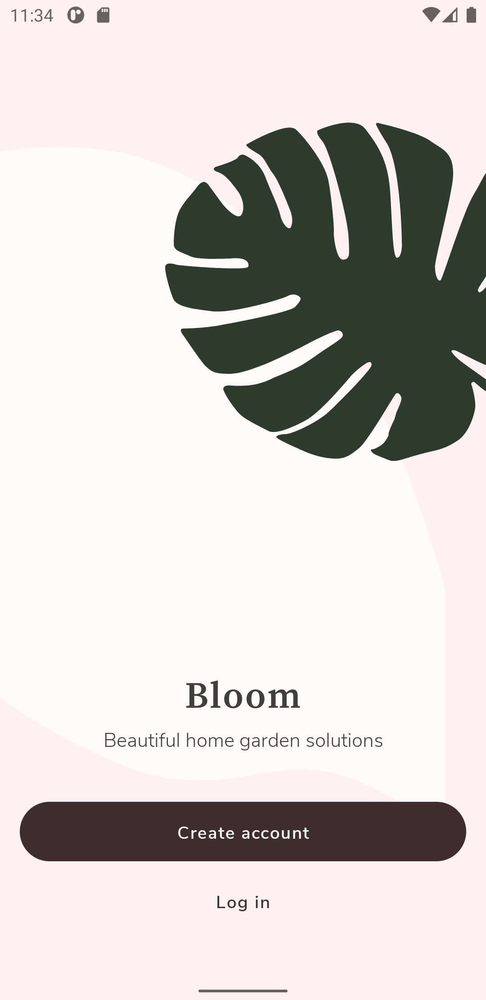
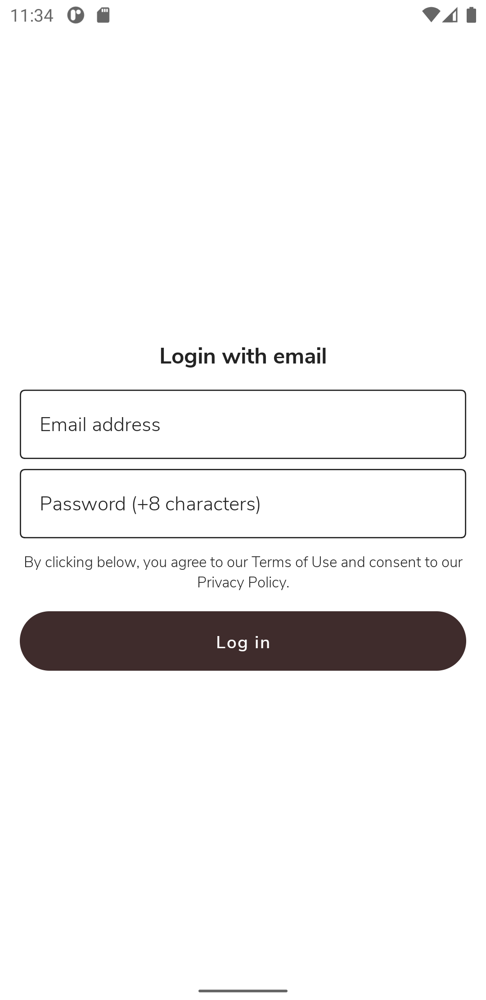
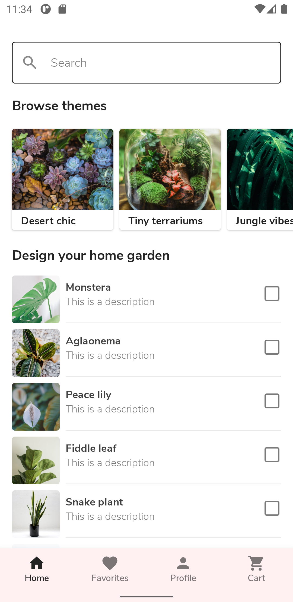
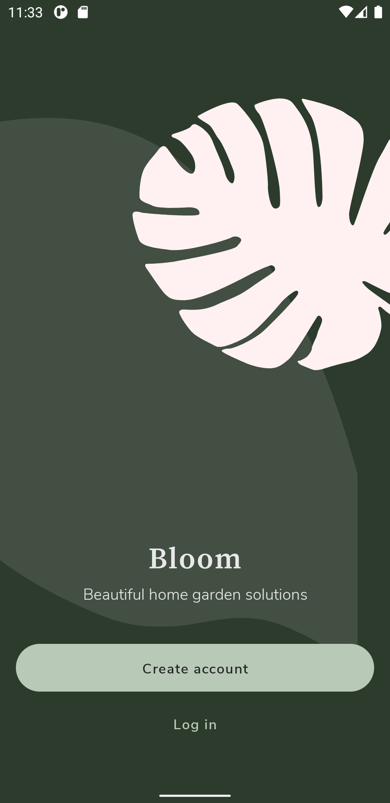
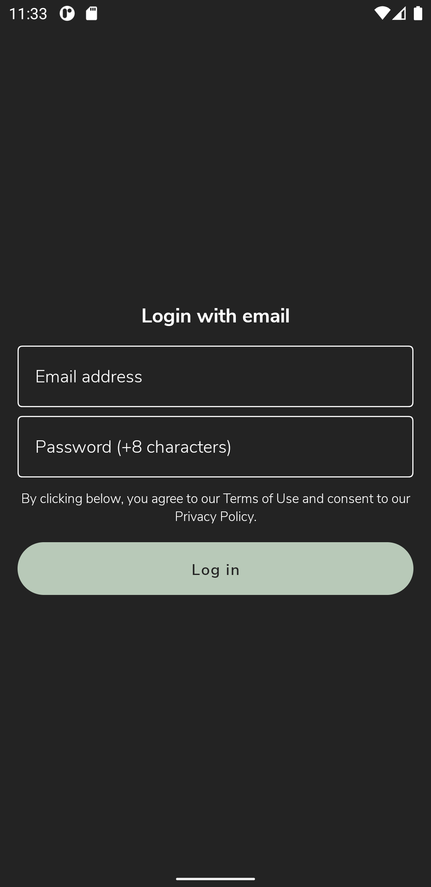
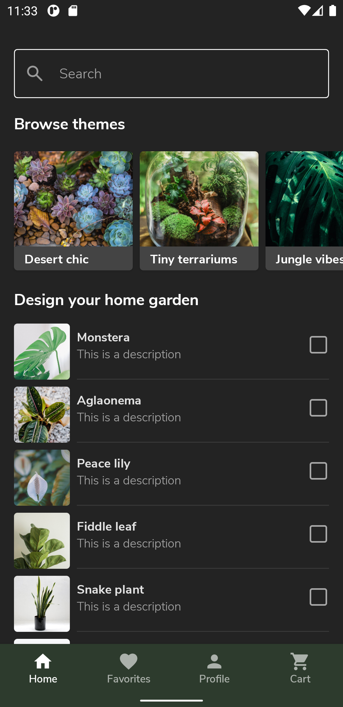

# Jetpack Compose - Android Dev Challenge

This repository contains some of the Android challenges for Jetpack Compose.

## Bloom
- Compose UI.
- Material theme guidelines.
- Basic State management.
- Compose Navigation.
- Display images from the network.
- Local Composition Providers.
- TextField, List, Buttons and more composables.

### Light mode
|  |  |  |
|----------|:-------------:|:-------------:|

### Dark mode
|  |  |  |
|----------|:-------------:|:-------------:|

